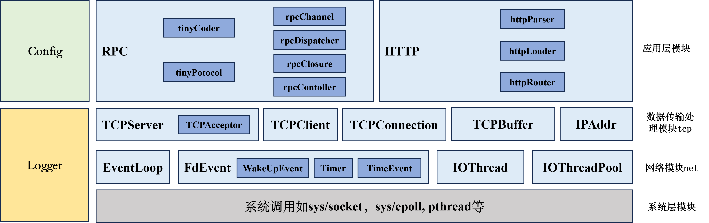
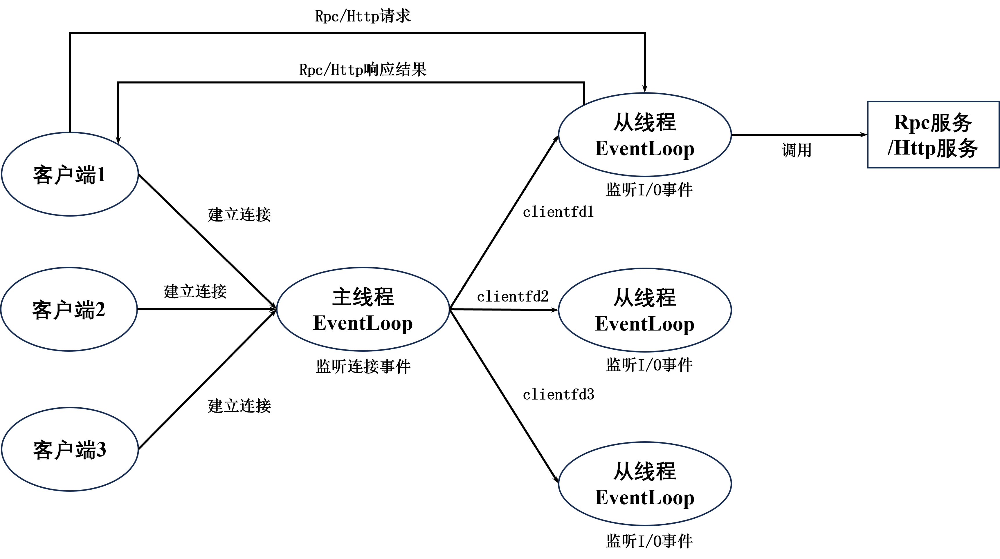
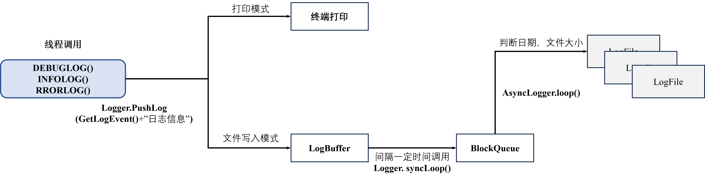
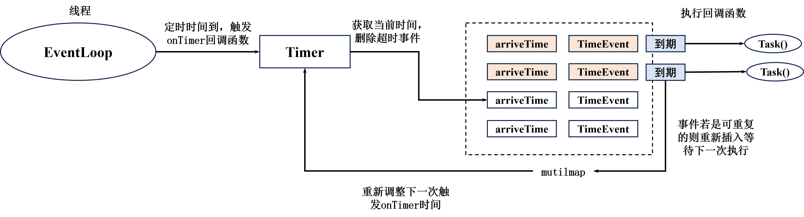
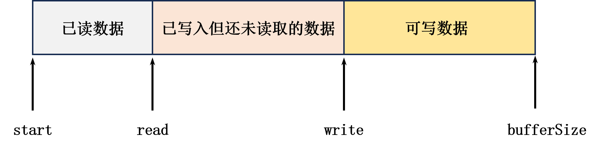
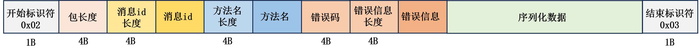
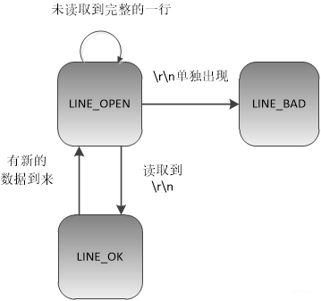
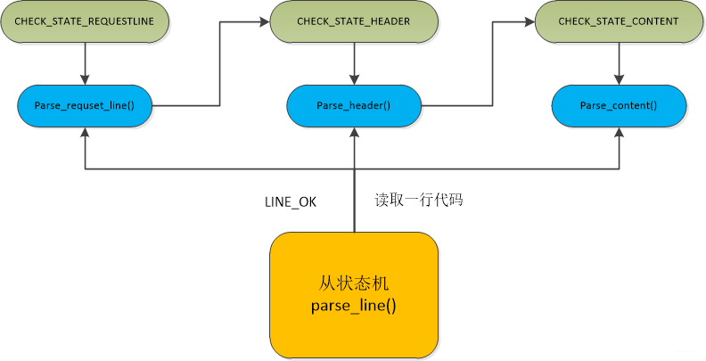
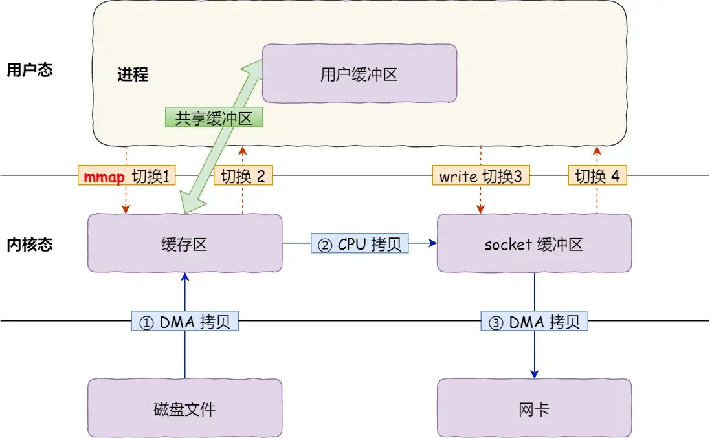

# 项目架构



# 项目网络框架




# 使用示例

**Pb文件**

```protobuf
syntax = "proto3";
option cc_generic_services = true;

message Request {
  int32 x = 1;
  int32 y = 2;
}

message Response {
  int32 z = 1;
}

service Compute {
  rpc Add(Request) returns (Response);
}
```

**Server使用**

```C++
#include "src/config/config.h"
#include "src/log/logger.h"
#include "src/rpc/rpc_dispatcher.h"
#include "src/tcp/tcp_server.h"
#include "pb/compute.pb.h"

class ComputeService : public Compute {
public:
    void Add(google::protobuf::RpcController* controller, const Request* req, Response* resp, 
        google::protobuf::Closure* done) override {
            resp->set_z(req->x() + req->y());
            if(done) done->Run();
        }
};

int main() {
    auto configInstance = ythe::Config::GetInstance();
    configInstance->Init("/root/cpp/ytheServer/config_server.xml");

    auto logInstance = ythe::Logger::GetInstance();
    logInstance->Init();

    auto cumputeService = std::make_shared<ComputeService>();
    ythe::RpcDispatcher::GetInstance()->RegisterService(cumputeService);

    auto addr = std::make_shared<ythe::IPNetAddr>(configInstance->mServerIp, configInstance->mServerPort);
    ythe::TCPServer server(addr);
    server.Start();
    return 0;
}
```

**Client使用**

```C++
#include "src/config/config.h"
#include "src/log/logger.h"
#include "pb/compute.pb.h"
#include "src/rpc/rpc_channel.h"
#include "src/rpc/rpc_closure.h"

int main() {
    auto configInstance = ythe::Config::GetInstance();
    configInstance->Init("/root/cpp/ytheServer/config_client.xml");

    auto logInstance = ythe::Logger::GetInstance();
    logInstance->Init();
    
    // 定义rpc channel
    auto addr = std::make_shared<ythe::IPNetAddr>(configInstance->mConnectIp, configInstance->mConnectPort);
    auto channel = std::make_shared<ythe::RpcChannel>(addr);
    channel->ConnectToServer();

    // 定义请求消息 reqPb 和相应消息体 respPb
    auto reqPb = std::make_shared<Request>();
    auto respPb = std::make_shared<Response>();
    reqPb->set_x(1);
    reqPb->set_y(1);
    
    // 定义rpc controller
    auto controller = std::make_shared<ythe::RpcController>();

    // 定义rpc closure
    auto closure = std::make_shared<ythe::RpcClosure>([reqPb, respPb, controller]{
        if(controller->GetErrorCode() == 0) {
            INFOLOG("call rpc success, request[%s], response[%s]", reqPb->ShortDebugString().c_str(), respPb->ShortDebugString().c_str())
            // 执行业务逻辑
        } else {
            ERRORLOG("call rpc failed, request[%s], error code[%d], error info[%s]",
                     reqPb->ShortDebugString().c_str(),
                     controller->GetErrorCode(),
                     controller->GetErrorInfo().c_str())
        }
    });
    
    // 定义rpc stub 执行rpc调用
    Compute_Stub computeStub(channel.get());
    computeStub.Add(controller.get(), reqPb.get(), respPb.get(), closure.get());
    channel->DisConnectFomServer();

    return 0;
}
```


# 1.配置文件模块

配置文件模块负责日志、服务端以及客户端参数配置，配置文件为xml文件，采用**tinyxml**库进行读取。

Ubuntu系统安装tinyxml：

```shell
sudo apt-get update
sudo apt-get install libtinyxml-dev
```

配置文件模块采用单例模式，初始化时指定xml文件路径。

```C++
auto configInstance = ythe::Config::GetInstance();
configInstance->Init("/path/to/your/config/file");
```

配置文件样例：

```xml
<?xml version="1.0" encoding="UTF-8" ?>
<root>
  <log>
    <log_is_print>1</log_is_print>
    <log_level>DEBUG</log_level>
    <log_file_name>test_server</log_file_name>
    <log_file_path>/root/cpp/ytheServer/testcase/logs/</log_file_path>
    <log_max_file_size>1000000000</log_max_file_size>
    <log_sync_interval>500</log_sync_interval>
  </log>

  <server>
    <ip>172.18.206.159</ip>
    <port>9000</port>
    <type>rpc</type>
    <buffer_size>128</buffer_size>
    <io_threads_num>3</io_threads_num>
  </server>
    
  <client>
    <connect_ip>172.18.206.159</connect_ip>
    <connect_port>9000</connect_port>
    <buffer_size>128</buffer_size>
  </client>
</root>
```


# 2.日志模块

## 2.1 功能介绍

​		日志模块负责打印记录程序执行时相应状态，可通过配置文件指定其输出形式（终端输出或文件输出），记录的内容包括以下信息

```
[日志等级][时间][程序调用行号][进程ID 线程ID]---日志信息
```

​		其中日志等级有三种模式分别为`DEBUG` `INFO` 和 `ERROR`，当日志模式为`DEBUG`时输出`DEBUG` `INFO` 和 `ERROR`三种类型，为`INFO`时输出 `INFO` 和 `ERROR`两种类型，为 `ERROR`时只输出 `ERROR`类型。

​		日志模块采用**单例模式**，使用前需初始化配置文件模块，例如：

```c++
auto configInstance = ythe::Config::GetInstance();
configInstance->Init("/path/to/your/config/file");

auto logInstance = ythe::Logger::GetInstance();
logInstance->Init();
```

​		可使用以下三种模式输出不同等级日志信息，支持C风格字符串格式化：

```C++
DEBUGLOG(str, ...)
INFOLOG(str, ...)
RRORLOG(str, ...)
```

## 2.2 模块设计

​		日志模块由日志触发器**Logger**，日志事件获取器**GetLogEvent**和写日志异步线程**AsyncLogger**组成。

​		日志触发器**Logger**负责记录程序执行状态，如果是终端输出模式，则将记录的状态和日志事件获取器**GetLogEvent**获取的信息（日志等级、时间、程序调用行号、进程ID、线程ID）直接打印至终端，否则将其写入至日志缓冲区**mBuffer**中隔一定时间将缓冲区内数据写入至写日志异步线程**AsyncLogger**的阻塞队列**BlockQueue**中。

​		写日志异步线程**AsyncLogger**在读取**BlockQueue**阻塞等待，当其中有数据到来时，获取其中的数据并将其内容写入至磁盘，写入时会根据日期和文件大小来判断是否创建新文件写入。



双缓冲区设计的日志模块具有以下好处：

1. **提高性能**：双缓冲区允许一个缓冲区用于写入日志信息的同时，另一个缓冲区可以将日志内容同步写入磁盘。这种设计能够减少由于频繁磁盘IO操作导致的性能瓶颈，从而提高日志记录的整体性能。
2. **提高并发性**：双缓冲区允许日志写入和磁盘同步操作并行进行，多个线程可以同时写入一个缓冲区，而另一个缓冲区负责将数据持久化到磁盘。
3. **更好的资源利用**：通过在日志记录过程中使用双缓冲区，可以更好地利用系统资源，尤其是磁盘IO带宽，避免磁盘的频繁读写切换，提高系统的吞吐量。


# 3.网络模块设计

## 3.1 FdEvent事件管理模块

**FdEvent**用于管理**文件描述符fd**，**epoll事件**以及相应的**回调函数**（读，写，错误处理）。

```C++
class FdEvent {
protected:
    int           mFd = -1;
    epoll_event   mEpollEvent {};

    std::function<void()> mReadCallBack;
    std::function<void()> mWriteCallBack;
    std::function<void()> mErrorCallBack;
    
    ...
}
```

在此基础上，通过继承**FdEvent**类，设计了两个特殊的事件管理模块分别为**WakeUpEvent**和**Timer**。

## 3.2 WakeUpEvent事件管理模块

​		**WakeUpEvent**负责唤醒阻塞在**epoll_wait()**的线程，其它线程可通过向**WakeUpEvent**所管理的**fd**对应的socket缓冲区写入数据，唤醒阻塞在**epoll_wait()**的线程。

​		使用时通过**eventfd()**创建文件描述并将**epoll_event**设置为**EPOLLIN**，调用方通过调用**Wakeup**函数向其**fd**缓冲区内写入数据，从而触发**WakeUpEvent**的可读事件从而唤醒被**epoll_wait()**所阻塞的线程。

```c++
WakeUpEvent::WakeUpEvent(): FdEvent()
{
    mFd = eventfd(0, EFD_NONBLOCK); // 创建wakeup_fd并设置为非阻塞

    auto cb = [this]() { // 定义回调函数读取缓冲区的数据
        char buf[8];
        while(read(mFd, buf, 8) != -1 && errno != EAGAIN) {}
        DEBUGLOG("read full bytes from wakeup fd[%d]", mFd)
    };
    SetFdEvent(IN_EVENT, cb); // 设置wakeup事件为读就绪同时传入对应的回调函数
}
```


```C++
void WakeUpEvent::Wakeup()
{
    char buf[8] = {'a'};
    auto ret = write(mFd, buf, 8);
    if(ret != 8)
        ERRORLOG("write to wakeup fd less than 8 bytes, fd[%d]", mFd)
    DEBUGLOG("success write %d bytes", ret)
}
```

​		该功能的主要作用用于主线程将监听得到的客户端连接**clientfd**，通过唤醒从属线程将该**clientfd**所对应的事件管理加入至从属线程的**epoll事件表**当中。

## 3.3 定时器模块

该模块主要由定时事件**TimerEvent**，定时时间管理**Timer**两部分组成。

定时事件**TimerEvent**用于保存**定时事件状态**和**定时回调函数**

```C++
class TimerEvent {
public:
    typedef std::shared_ptr<TimerEvent> sp;
    
private:
    int64_t                 mArriveTime = 0;       // 定时器执行时的时间 ms
    int64_t                 mInterval   = 0;       // 定时器执行时间间隔 ms
    bool                    mIsRepeated = false;   // 定时器任务执行是否重复
    bool                    mIsCanceled = false;   // 是否被删除
    std::function<void()>   mTask;                 // 定时器回调函数
    
    ...
}
```

**Timer**用于管理**TimerEvent**，采用红黑树结构（std::multimap）根据定时任务的**arriveTime**进行排序。

```C++
class Timer: public FdEvent {
private:
    std::multimap<int64_t, TimerEvent::sp> mPendingEvents; // 根据事务的 arrive_time 进行排序
    std::mutex mMutex;

private:
    ...
    void onTimer(); // 定时器回调函数，并删除超时的定时事件
    ...
};
```

使用时需要将**Timer**的**epollEvent**设置**EPOLLIN**并注册至**epoll事件表**中，其文件描述符使用库函数**timerfd_create()**和**timerfd_settime()**实现，**timerfd_settime()**可以设置指定时间，时间一到便向其**fd**缓冲区写入数据，触发**epoll可读事件**进而执行**onTimer()**回调函数。

```C++
mFd = timerfd_create(CLOCK_MONOTONIC, TFD_NONBLOCK | TFD_CLOEXEC);
SetFdEvent(IN_EVENT, std::bind(&Timer::onTimer, this));
```

```C++
int ret = timerfd_settime(mFd, 0, &value, nullptr); // 指定时间一道便会触发可读事件
```

​		执行**onTimer**回调函数时，根据当前系统时间从队列中提取出超时的**TimerEvent**并执行对应的**定时回调函数**，同时把需要重复执行的 **TimerEvent** 的**mArriveTime**加上**mInterval**后再次添加至队列中。



定时器**onTimer**所执行的任务包括：

- 日志定期刷盘：可将**Logger.syncLoop**函数绑定至**TimerEvent**中，再将该**TimerEvent**加入至**onTimer**。
- 服务端定期检查断开的client连接并删除：将client连接加入至std::set中，服务端通过**onTimer**定期检查集合，将断开的连接清除。
- RPC调用超时：给RPC调用设置超时时间，超时则触发**TimerEvent**，如果没有得到调用结果，返回超时错误给客户端。


## 3.4 EventLoop事件循环监听模块

```C++
class EventLoop {
private:
    pid_t         mThreadId;  // 标识本 event_loop 所属线程
    int           mEpollfd;   // epoll文件描述符
    std::set<int> mListenFds; // 管理已经被注册至epoll事件表的文件描述符

    WakeUpEvent*  mWakeUpEvent = nullptr;
    Timer*        mTimer       = nullptr;
    bool          mIsLooping   = false;

    std::mutex    mMutex;
    std::queue<std::function<void()>> mPendingTasks;  // eventloop 任务队列
    
    ...
    
}
```

​		每个**EventLoop**含有一个所属线程ID用于表示该**EventLoop**所属那个线程，用于区分**主线程EventLoop**和**从属线程EventLoop**，当主线程获取到连接套接字时**clientfd**，需要将该套接字对应的**FdEvent**加入到从属线程的**epoll事件表**中，可通过**Wakeup**唤醒从属线程。

```C++
void EventLoop::AddFdEventToEpoll(FdEvent* fdEvent)
{
    // 当前操作的线程与event_loop所属线程不同，将任务加入从属event_loop的任务队列中
    // 通过wakeup唤醒从属线程的event_loop，执行任务队列中的任务
    if(GetThreadId() == mThreadId) {
        addFdEventToEpoll(fdEvent);
    } else {
        auto cb = [this, fdEvent]() { addFdEventToEpoll(fdEvent); };
        {
            std::lock_guard<std::mutex> lock(mMutex);
            mPendingTasks.push(cb);
        }
        mWakeUpEvent->Wakeup();
    }
}
```

​		每个**EventLoop**包含一个**Timer**和**WakeUpEvent**，并在初始化时将他们的**epoll_event**设置为**EPOLLIN**并加入epoll事件表当中进行监听。

```C++
EventLoop::EventLoop()
{
    mThreadId = GetThreadId();
    mEpollfd = epoll_create1(EPOLL_CLOEXEC);
   ...

    mWakeUpEvent = new WakeUpEvent();
    DEBUGLOG("create wakeup fd[%d]", mWakeUpEvent->GetFd())
    addFdEventToEpoll(mWakeUpEvent);

    mTimer = new Timer();
    DEBUGLOG("create timer fd[%d]", mTimer->GetFd())
    addFdEventToEpoll(mTimer);

	...
}
```

​		该模块还包含一个任务队列**PendingTasks**以及一个用于监听I/O事件的循环函数**Loop()**，**Loop()**通过**epoll_wait()**循环监听对应的I/O事件得到对应的**FdEvent**，判断可读可写事件将**FdEvent**对应的回调函数添加到**PendingTasks**中并在下一轮**epoll_wait()**循环监听时执行队列中的任务。

```C++
int numEvents = epoll_wait(mEpollfd, events, MAX_EVENT_NUMBER, -1);

...
    
for(int i = 0; i < numEvents; ++i) {
    epoll_event triggerEvent = events[i];
    auto fdEvent = static_cast<FdEvent *>(triggerEvent.data.ptr);
	...
    if(triggerEvent.events & EPOLLIN) {
        ...
        addTask(fdEvent->GetCallBack(IN_EVENT));
    }
    if(triggerEvent.events & EPOLLOUT) {
        ...
        addTask(fdEvent->GetCallBack(OUT_EVENT));
    }
    if(triggerEvent.events & EPOLLERR) {
        DEBUGLOG("fd[%d] trigger EPOLLERROR event", fdEvent->GetFd())
        if(fdEvent->GetCallBack(ERROR_EVENT) != nullptr) {
            ...
            addTask(fdEvent->GetCallBack(ERROR_EVENT));
        }
        deleteFdEventFromEpoll(fdEvent); // 删除出错的套接字
    }
}
```

​		

## 3.5 I/O线程，线程组模块

​		该模块主要是对**std::thead**进行封装，每一个I/O线程对应一个**EventLoop**作为**从属Reactor**，每当启动一个**IOThread**便启动其内部**EventLoop**对I/O事件进行监听。

```C++
class IOThread {
public:
    typedef std::shared_ptr<IOThread> sp;

private:
    pid_t                   mThreadId  = -1;
    std::thread             mThread;
    EventLoop*              mEventLoop = nullptr;
    
    ...
    
}

ythe::IOThread::IOThread()
{
    mThread = std::thread(&IOThread::loop, this);
    
	...
}

void IOThread::loop()
{
    mThreadId = GetThreadId();
    mEventLoop = new EventLoop();
    
	 ...
         
    mEventLoop->Loop();
}
```

​		I/O线程组负责管理**IOThread**，内部使用一个静态数组存储启动的**IOThread**，并采用轮询机制获取对应的**IOThread**。

```C++
class IOThreadPool {
private:
    int mSize  = 3;
    int mIndex = 0;

    std::vector<IOThread *> mIOThreadGroup;
    
	...

}

void IOThreadPool::Init(int size)
{
    mSize = size;
    mIOThreadGroup.resize(mSize);
    for(int i = 0; i < mSize; ++i) {
        mIOThreadGroup[i] = new IOThread();
    }
}

IOThread* IOThreadPool::GetIOThread()
{   auto tmp = mIOThreadGroup[mIndex];
    mIndex = (mIndex + 1) % mSize;
    return tmp;
}
```

# 4.数据传输处理模块

## 4.1 网络地址模块IPNetAddr

​		该模块负责对系统socket协议栈的相关地址进行封装，简化代码，使得在开发过程中更加容易使用。包括一个协议栈地址 `mAddr` 以及用于初始化该协议栈地址的ip地址 `mIpStr` 和 端口号 `mPort`。支持以 `"ip" + "port"`，`"ip:port"` 和 `"sockaddr_in"`三种形式初始化使用。

```C++
class IPNetAddr: public NetAddr {
private:
    std::string    mIpStr;
    uint16_t       mPort;
    sockaddr_in    mAddr;

public:
    IPNetAddr(std::string& ip, uint16_t port);    // 以 "ip" + "port" 的形式初始化

    explicit IPNetAddr(const std::string& addr); // 以 "ip:port" 的形式初始化

    explicit IPNetAddr(sockaddr_in addr);        // 以 "sockaddr_in" 的形式初始化
    
    ...
    
}
```

## 4.2 缓冲区模块TCPBuffer

​		该模块负责缓存接收以及发送的数据，滑动窗口的形式接收以及发送缓存数据，同时该模块相比原始的字符数组具有缓冲安全的作用，当缓冲区内容不足时能够自动扩容，避免缓冲区溢出问题。

​		缓冲区内容由三个指针进行控制分别是缓冲区起始地址 `start`，读指针 `read` 和 写指针`write`。

```C++
class TCPBuffer {
public:
    typedef std::shared_ptr<TCPBuffer> sp;

private:
    int mReadIndex  = 0;

    int mWriteIndex = 0;

public:
    std::vector<char> mBuffer;
    
    ...
    
}
```



向缓冲区写入数据时向右移动写指针`write`，可写空间不足时扩充缓冲区大小。

```C++
void TCPBuffer::WriteToBuffer(const char* buf, int writeSize)
{
    if(writeSize > WriteAble()) {
        int newSize = 1.5 * (mWriteIndex + writeSize);
        ResizeBuffer(newSize);
    }
    std::copy_n(buf, writeSize, mBuffer.begin() + mWriteIndex);
    MoveWriteIndex(writeSize);
}

void TCPBuffer::ResizeBuffer(int newSize)
{
    if(newSize < mBuffer.size())
        return;
    std::vector<char> tmp(newSize);
    int cpCount = ReadAble(); // 需要拷贝的字节数
    std::copy_n(mBuffer.begin() + mReadIndex, cpCount, tmp.begin());

    // 重新设置缓冲区
    mBuffer.swap(tmp);
    mReadIndex = 0;
    mWriteIndex = mReadIndex + cpCount;
}
```

缓冲区读取数据时向右移动读指针`read`。当已读数据超过总容量的1/2时，需要重新调整缓冲区，删除已读数据。

```C++
void TCPBuffer::adjustBuffer()
{
    if(mReadIndex < (mBuffer.size() / 2))
        return;
    std::vector<char> tmp(mBuffer.size());
    int cpCount = ReadAble();
    std::copy_n(mBuffer.begin() + mReadIndex, cpCount, tmp.begin());

    // 重新设置缓冲区
    mBuffer.swap(tmp);
    mReadIndex = 0;
    mWriteIndex = mReadIndex + cpCount;
}
```

## 4.3 TCP连接管理模块TCPConnection

​		该模块负责管理**EventLoop**的I/O可读可写事件，有两种类型 `TCPConnectionByServer` 作为服务端使用，代表跟对端客户端的连接和 `TCPConnectionByClient`作为客户端使用，代表跟对端服务端的连接，不同类型对应的可读可写事件不同。

​		连接一共有三种状态分别为未连接`NotConnected`，连接`Connected`和关闭`Closed`三种状态。每个连接维护一个**连接事件描述符管理**`mConnEvent`和持有该连接对应IO线程的 **EventLoop**事件，同时管理一个接收缓冲区和发送缓冲区，用来处理接收数据和发送数据。

```C++
enum TCPConnectionType {
    TCPConnectionByServer = 1,  // 作为服务端使用，代表跟对端客户端的连接
    TCPConnectionByClient = 2,  // 作为客户端使用，代表跟对端服务端的连接
};

enum TCPConnectionState {
    NotConnected = 1,
    Connected    = 2,
    Closed       = 3,
};

class TCPConnection
{
public:
    typedef std::shared_ptr<TCPConnection> sp;

private:
    FdEvent*           mConnEvent;   // 连接事件描述符管理
    EventLoop*         mEventLoop;   // 持有该连接的IO线程的 event_loop 事件
	
	...
	
    TCPBuffer::sp      mRecvBuffer;  // 接收缓冲区
    TCPBuffer::sp      mSendBuffer;  // 发送缓冲区

    ...
    
    void onRead();      // 可读事件回调函数，读取客户发送的数据，组装为RPC请求

    void execute();     // 将 RPC 请求作为入参，执行业务逻辑得到 RPC 响应

    void onWrite();     // 可写事件回调函数，将RPC响应 out_buffer 发送给客户端
```

​		每个连接有对应的**可读事件回调函数**和**可写事件回调函数**以及一个**事件任务处理函数**，每创建一个**TCPConnection**时便将**可读事件回调函数**注册至`mConnEvent`中同时将`mConnEvent`添加至**epoll**事件表当中。

```C++
TCPConnection::TCPConnection(FdEvent* fdEvent, EventLoop* eventLoop, int bufferSize, TCPConnectionType type) : mConnEvent(fdEvent), mEventLoop(eventLoop), mType(type)
{
    // 初始化连接状态
    mState = NotConnected;

    // 初始化接收发送缓冲区
    mRecvBuffer = std::make_shared<TCPBuffer>(bufferSize);
    mSendBuffer = std::make_shared<TCPBuffer>(bufferSize);

    // 监听可读事件
    mConnEvent->SetFdEvent(IN_EVENT, std::bind(&TCPConnection::onRead, this));
    if(setET)
        mConnEvent->SetEpollET();
    mEventLoop->AddFdEventToEpoll(mConnEvent);
    
    ...
 }
```

## 4.4 TCP服务端模块TCPServer，TCPAccptor

```C++
class TCPServer {
private:
    FdEvent*                          mListenEvent;   // 监听套接字事件描述符管理
    EventLoop*                        mEventLoop;     // 主线程事件循环，负责监听连接套接字


    IOThreadPool*                     mIOThreadPool;
    int                               mIOThreadPoolNum;

    TCPAcceptor::sp                   mAcceptor;
    TimerEvent::sp                    mTimerEvent;
    
    ...
    
    void onAccept(); // 连接套接字回调函数，负责处理客户连接

    void onClearClientTimerFunc(); // 定时器回调函数，清除 closed 的连接
    
    ...
}
```

​		该模块负责客户端连接事件管理，客户端连接套接字分配，定时触发日志异步写入和定期删除关闭的TCP连接。

```C++
TCPServer::TCPServer(const IPNetAddr::sp& localAddrr)
{   
    mIOThreadPoolNum = Config::GetInstance()->mIOThreadNums;

    // 初始化 TCPAcceptor
    mAcceptor = std::make_shared<TCPAcceptor>(localAddrr);
    mLocalAddr = mAcceptor->GetLocalAddr();

    // 初始化 监听套接字事件 mListenEvent 不使用ET模式, 加入到epoll事件表中
    mListenEvent = new FdEvent(mAcceptor->GetListenFd());
    mListenEvent->SetFdEvent(TriggerEvent::IN_EVENT, std::bind(&TCPServer::onAccept, this));

    // 初始化 从线程 IOThreadGroup
    mIOThreadPool = IOThreadPool::GetInstance();
    mIOThreadPool->Init(mIOThreadPoolNum);

    // 初始化 定时器事件(日志写入，清除断开连接)
    mTimerEvent = std::make_shared<TimerEvent>(10000, true, std::bind(&TCPServer::onClearClientTimerFunc, this));

    // 初始化 主线程 EventLoop
    mEventLoop = new EventLoop();
    mEventLoop->AddFdEventToEpoll(mListenEvent);
    mEventLoop->AddTimerEvent(mTimerEvent);
    mEventLoop->AddTimerEvent(Logger::GetInstance()->GetTimeEvent());
}
```

​		首先通过**TCPAccptor**进行监听初始化，当有客户端连接时通过**TCPAccptor**中**accept**方法获取客户端套接字**clientfd**，随后创建**TCPConnection**将客户端套接字**clientfd**和**从属IO线程**对应的**EventLoop**进行绑定，使得从属**EventLoop**监听**clientfd**对应的I/O可读可写事件。

```C++
void TCPServer::onAccept()
{
    auto [clientFd, clientAddr] = mAcceptor->TCPAccept();
    auto threadHander = mIOThreadPool->GetIOThread();
    // 将 clientFd 和 clientAddr 绑定到从属线程的eventloop中
    FdEvent* clientFdEvent = new FdEvent(clientFd);
    clientFdEvent->SetNonBlock(); // ET模式设置非阻塞

    auto conn = std::make_shared<TCPConnection>(
        clientFdEvent, threadHander->GetEventLoop(), mBuffersize, mLocalAddr, clientAddr);
    conn->SetState(Connected);
    
    ...
}
```

## 4.4 TCP客户端模块TCPClient

​		该模块负责连接对端服务，同时发送请求数据并返回请求结果。

```C++

void TCPClient::onConnect()
{
    int ret = connect(mConnFd, mPeerAddr->GetSockAddr(), mPeerAddr->GetSockLen());
    if (ret == -1 && errno == EINPROGRESS) {
        ret = connect(mConnFd, mPeerAddr->GetSockAddr(), mPeerAddr->GetSockLen());
        if (ret == -1 && errno != EINPROGRESS) {
            mConnectErrorCode = ERROR_FAILED_CONNECT;
            mConnectErrorInfo = "connect unknown error, sys error = " + std::string(strerror(errno));
            return;
        }
        INFOLOG("connect [%s] success", mPeerAddr->ToString().c_str())
        mConn->SetState(Connected);
        return;
    }
    if (ret == -1 && errno != EINPROGRESS) {
        if (errno == ECONNREFUSED) {
            mConnectErrorCode = ERROR_PEER_CLOSED;
            mConnectErrorInfo = "connect refused, sys error = " + std::string(strerror(errno));
        } else {
            mConnectErrorCode = ERROR_FAILED_CONNECT;
            mConnectErrorInfo = "connect unknown error, sys error = " + std::string(strerror(errno));
        }
        return;
    }

    INFOLOG("connect [%s] success", mPeerAddr->ToString().c_str())
    mConn->SetState(Connected);
    return;
}
```

```C++
void TCPClient::OneCall(const TCPBuffer::sp &sendData, TCPBuffer::sp &recvData)
{
    if(mConn->GetState() != Connected) {
        ERRORLOG("fd[%d] no connect, one call error", mConnFd)
        return;
    }
    mConn->SetSendBuffer(sendData);
    mConn->ListenWriteEvent();
    StartEventLoop();
    recvData = mConn->GetRecvBuffer();
}
```

# 5 应用层模块

## 5.1 RPC通信协议以及编码/解码器模块

​		用户和服务发送RPC请求/响应消息时需要定义编写proto文件，使用如下命令生成pb文件，通过protobuf序列化和反序列化机制完成网络通信。

```shell
protoc order.proto --cpp_out=./
```

​		由于通信服务采用TCP传输，TCP是一种基于字节流的传输方式，没有消息边界，需要在应用层定义相应的消息体以保证正确获取消息内容。本项目的消息定义如下，采用包头+包体的形式定义消息边界。



​		编码模块负责将上述定义好的消息体写入至TCPBuffer中用于后续发送，解码模块则将接收数据的TCPBuffer中解析后写回响应消息体中，调用接口如下。

```C++
    // 将 message 对象转化为字节流，写入到 in_buffer，编码
    void Encode(std::vector<AbstractProtocol::sp>& messages, TCPBuffer::sp buffer);

    // 将 buffer 里面的字节流转换为 message 对象，解码
    void Decode(TCPBuffer::sp buffer, std::vector<AbstractProtocol::sp>& messages);
```


## 5.2 RPC服务分发模块RpcDispatcher

​		该模块负责服务端服务注册，并根据请求体中的方法名获取注册的服务`service`以及对应的方法`method`，执行服务调用后返回响应消息。

```C++
// 获取请求消息方法名并解析出 serviceName 和 methodName
std::string methodFullName = req->mMethodName;
std::string serviceName;
std::string methodName;
if(!parseServiceFullName(methodFullName, serviceName, methodName)) {
    setTinyPBError(resp, ERROR_PARSE_SERVICE_NAME, "parse service name error");
    return;
}

// 取出 service 对象
auto it = mServiceMap.find(serviceName); 
if(it == mServiceMap.end()) {
    ERRORLOG("%s | service name[%s] not found", req->mMsgId.c_str(), serviceName.c_str())
    setTinyPBError(resp, ERROR_SERVICE_NOT_FOUND, "service not found");
    return;
}
auto service = it->second;

// 根据 methodName 找到 service 对象的 method
auto method = service->GetDescriptor()->FindMethodByName(methodName);

...
    
// 调用 rpc 方法
service->CallMethod(method, rpcController, reqMsg, respMsg, rpcClosure);
```

​		调用接口以及调用方式如下

```C++
void Dispatch(const AbstractProtocol::sp& reqMessage, const AbstractProtocol::sp& respMessage, IPNetAddr::sp localAddr, IPNetAddr::sp peerAddr);
```

```C++
void TCPConnection::execute()
{
    std::vector<AbstractProtocol::sp> reqMessages;
    std::vector<AbstractProtocol::sp> respMessages;

    // 从 RecvBuffer 里 decode 得到 reqMessages 对象
    mCoder->Decode(mRecvBuffer, reqMessages);
    for(auto& req: reqMessages) {
        // 针对每一个请求，调用 rpc 方法，获取 resp
        std::shared_ptr<TinyPBProtocol> resp = std::make_shared<TinyPBProtocol>();
        RpcDispatcher::GetInstance()->Dispatch(req, resp, mLocalAddr, mPeerAddr);
        respMessages.emplace_back(resp);
    }
    // 消息写回，将响应体 respMessages 放入到发送缓冲区，监听可写事件回包
    mCoder->Encode(respMessages, mSendBuffer);
    ListenWriteEvent();
}
```

​		调用服务时还需要定义用于执行服务的请求/响应消息体`reqMsg` `respMsg`，Rpc控制器**RpcController**，Rpc回调函数**RpcClosure**。`reqMsg`通过Rpc请求体中序列化数据反序列化得到。

```C++
 // 反序列化，将请求体 req 中的 pbData 反序列化
auto reqMsg = service->GetRequestPrototype(method).New();
auto respMsg = service->GetResponsePrototype(method).New();
reqMsg->ParseFromString(req->mPbData);
```

**RpcController**主要负责记录执行服务时的一些状态信息包括服务执行是否结束，执行本地地址和对端地址，执行的消息id等。

```C++
// 初始化 rpcController
auto rpcController = new RpcController();
rpcController->SetLocalAddr(localAddr);
rpcController->SetPeerAddr(peerAddr);
rpcController->SetMsgId(req->mMsgId);
```

**RpcClosure**负责服务执行完后作出相应处理，例如将结果`respMsg`序列化至相应消息体中。

```C++
 // 初始化 rpcClosure
auto rpcClosure = new RpcClosure([reqMsg, req, respMsg, resp]() {
    respMsg->SerializeToString(&(resp->mPbData);
});
```

最终执行相应服务

```C++
// 调用 rpc 方法
service->CallMethod(method, rpcController, reqMsg, respMsg, rpcClosure);
```


## 5.3 RPC客户端请求模块RpcChannel

```C++
class RpcChannel: public google::protobuf::RpcChannel {
private:
    AbstractCoder*  mCoder;    
    TCPClient::sp   mClient;

public:
    RpcChannel(const IPNetAddr::sp& peerAddr);

    ~RpcChannel() override;

public:
	...

    void CallMethod(const google::protobuf::MethodDescriptor* method,
                   google::protobuf::RpcController* rpcController,
                   const google::protobuf::Message* reqPb,
                   google::protobuf::Message* respPb,
                   google::protobuf::Closure* done ) override;
};
```

​		该模块将**TCPClient**进行进一步封装，通过重写**CallMethod**方法调用Rpc服务。发送消息前需要将消息进行组装包括消息id，方法名，以及序列化数据。

```C++
// 获取 msg_id
// 如果 controller 指定了 msgId, 直接使用
if(myController->GetMsgId().empty()) {
    reqMessage->mMsgId = GetMsgID(10);
    myController->SetMsgId(reqMessage->mMsgId);
} else {
    reqMessage->mMsgId = myController->GetMsgId();
}

// 获取 methodName
reqMessage->mMethodName = method->full_name();

// reqPb 序列化至 mPbData
if(!reqPb->SerializePartialToString(&(reqMessage->mPbData))) {
    std::string errInfo = "failed to serialize";
    myController->StartCancel();
    myController->SetError(ERROR_FAILED_SERIALIZE, errInfo);
    if(done) {
        done->Run();
    };
    myController->SetFinished(true);
    return;
}
```

​		数据组装完成后调用**TCPClient**的**OneCall**方法执行一次数据发送和接受请求最终将**RpcController**的执行状态标志为**结束**。

```C++
// 发送数据
std::vector<AbstractProtocol::sp> reqMessages;
reqMessages.push_back(reqMessage);
TCPBuffer::sp dataToSend = std::make_shared<TCPBuffer>(128);
// 接收数据
std::vector<AbstractProtocol::sp> respMessages;
TCPBuffer::sp dataToRecv;
// 调用方法
mCoder->Encode(reqMessages, dataToSend);
mClient->OneCall(dataToSend, dataToRecv);
mCoder->Decode(dataToRecv, respMessages);

 // 获取结果
for(const auto& respMsg : respMessages) {
    if(reqMessage->mMsgId != respMsg->mMsgId)
        continue;
    auto respMessage = std::dynamic_pointer_cast<TinyPBProtocol>(respMsg);
    if(respMessage->mErrCode != 0) {
		
        ...
        
        if(done) { done->Run(); } // 执行回调函数
        myController->SetFinished(true); // 执行状态标志为结束
    }
}
```


## 5.4 HTTP模块

暂时还未集成，可参考项目[HeYaoting666/MyWebServer: Tiny WebServer (github.com)](https://github.com/HeYaoting666/MyWebServer)

### **HTTP有限状态机**

1.  **从状态机**状态转移图



从状态机三种状态

- LINE_OK ,完整读取一行
- LINE_OPEN，读取的行不完整
- LINE_BAD，读取的报文有误

​		从状态机每次从缓冲区读取一行信息，直至读取到 \r\n 表示读取到一行，同时将 \r\n 替换为 \0\0 便于主状态机读取该行，然后再将行起始标志定位到下一行的起始位置。

2.**主状态机**有三种状态

- CHECK_STATE_REQUESTLINE，解析请求行
- CHECK_STATE_HEADER，解析头部信息
- CHECK_STATE_CONTENT，解析正文

主状态机的状态转移图：



​		主状态机的初始状态是CHECK_STATE_REQUESTLINE，parse_request_line()函数中解析请求行，当解析请求行成功时，解析请求行内部函数将主状态转移至下一个状态。

​		当请求方法为GET时，请求报文没有请求正文，也就是说解析完头部字段后该报文的解析过程就完成了。
解析请求行比较重要的一点是需要保存url，url对应客户端请求的文档。


### **mmap()+write()**

​		read() 系统调用的过程中会把内核缓冲区的数据拷贝到用户的缓冲区里，于是为了减少这一步开销，我们可以用 mmap() 替换 read() 系统调用函数。

```C
buf = mmap(file, len);
write(sockfd, buf, len);
```

mmap() 系统调用函数会直接把内核缓冲区里的数据「映射」到用户空间，这样，操作系统内核与用户空间就不需要再进行任何的数据拷贝操作。



具体过程如下： 

- 应用进程调用了 mmap() 后，DMA 会把磁盘的数据拷贝到内核的缓冲区里。接着，应用进程跟操作系统内核「共享」这个缓冲区； 

- 应用进程再调用 write()，操作系统直接将内核缓冲区的数据拷贝到 socket 缓冲区中，这一切都发生在内核态，由 CPU 来搬运数据；

- 最后，把内核的 socket 缓冲区里的数据，拷贝到网卡的缓冲区里，这个过程是由 DMA 搬运的。 我们可以得知，通过使用 mmap() 来代替 read()， 可以减少一次数据拷贝的过程。
